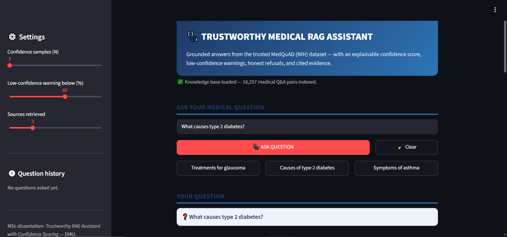
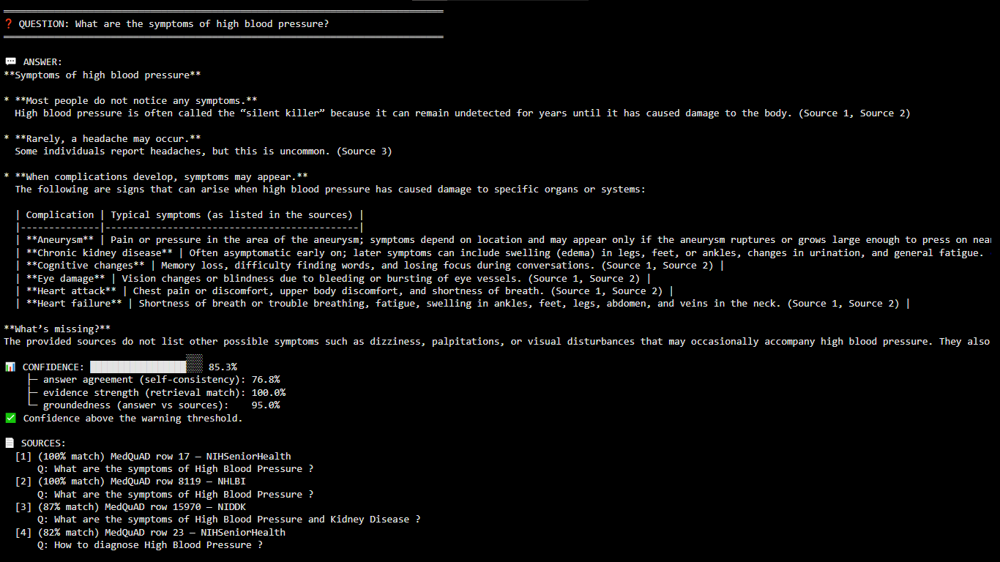
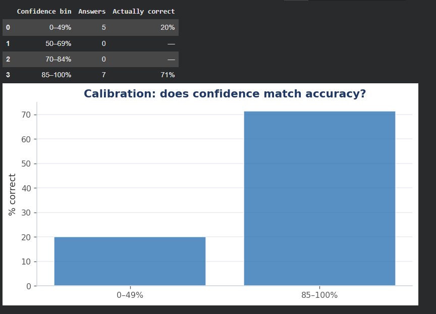
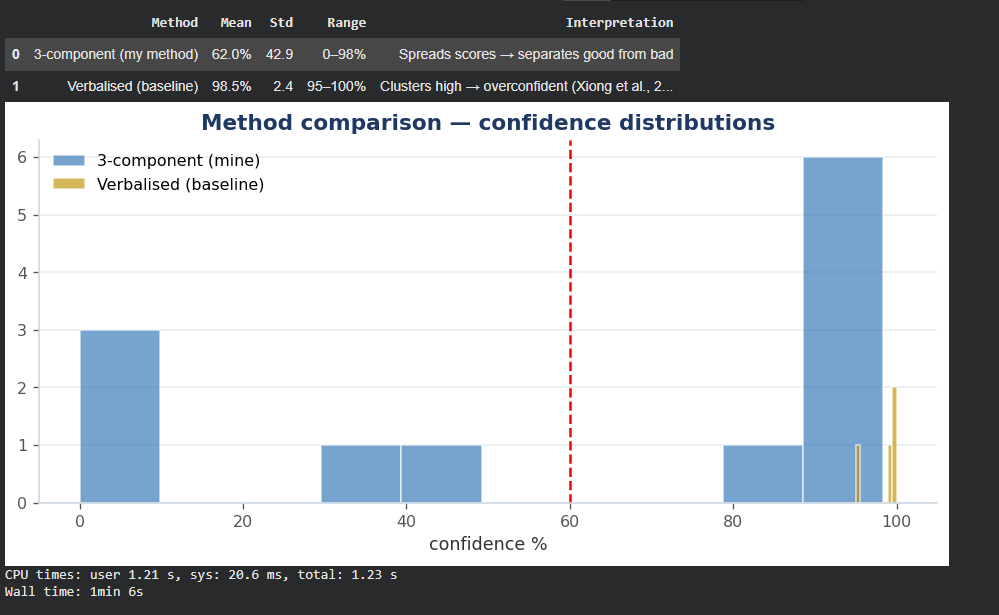
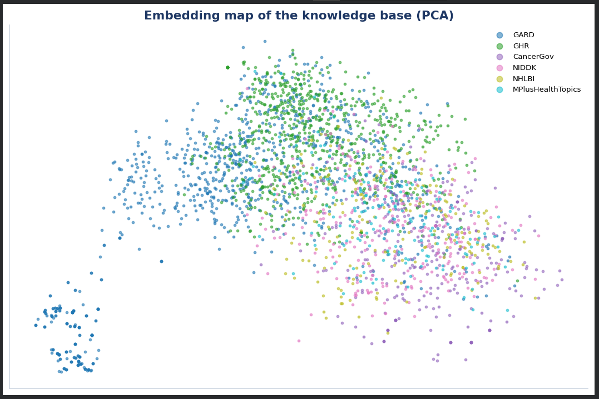

# Trustworthy Medical RAG Assistant with Confidence Scoring

A grounded medical question-answering system that tells you **when to trust its answers**.
Built as an MSc Artificial Intelligence dissertation project at De Montfort University (2025/26).

Large language models hallucinate — and standard chat interfaces give you no signal for when an
answer should be trusted. This project combines **Retrieval-Augmented Generation (RAG)** over the
NIH MedQuAD medical dataset with an **explainable, per-answer confidence score**, so every answer
arrives with cited sources, a confidence meter, a low-confidence warning, or an honest refusal.



---

## Key results

Evaluated on held-out MedQuAD questions (see `thesis/` for the full dissertation):

- **8 of 12** answerable questions answered correctly under a semantic-similarity criterion
- Mean confidence was **15.8 percentage points higher** for correct answers (95.9%) than for
  incorrect ones (80.1%) — the score separates reliable from unreliable answers
- **All 6** deliberately unanswerable questions were correctly refused instead of guessed
- A comparison against verbalized ("I am 90% confident…") confidence reproduced the
  overconfidence reported in prior work — measured signals beat self-reported ones




---

## How it works

```
  MedQuAD (NIH)                  FAISS vector store            Groq LLM
  16,357 cleaned Q&A  →  69,515  →  all-MiniLM-L6-v2   →  strict grounding
  pairs                      search keys  embeddings      prompt (sources only)
                                                        │
  Question → question-to-question semantic match → parent answers retrieved
                                                        │
                                    ┌───────────────────┴───────────────────┐
                                    │  3-component confidence score          │
                                    │  0.60 × answer agreement               │
                                    │      (self-consistency across samples) │
                                    │  0.25 × evidence strength              │
                                    │      (retrieval similarity)            │
                                    │  0.15 × groundedness                   │
                                    │      (answer ↔ source alignment)       │
                                    └───────────────────┬───────────────────┘
                                                        │
                    Answer + confidence meter + cited sources
                    — or a low-confidence warning (< 60%),
                    — or an honest refusal when nothing relevant exists.
```

The Streamlit app (`app.py`) adds a polished GUI: question history, adjustable sampling and
warning thresholds, per-source relevance bars, response metrics, and downloadable answer reports.




---

## Repository contents

| File | What it is |
|---|---|
| `app.py` | The Streamlit web application (GUI, confidence scoring, Q&A pipeline) |
| `Trustworthy_RAG_Confidence.ipynb` | The full Colab notebook: data prep → FAISS index → RAG → evaluation → GUI launch |
| `thesis/SHEHRYAR_MSc_Thesis.pdf` | The complete MSc dissertation |
| `screenshots/` | GUI, confidence, calibration and evaluation visuals |
| `requirements.txt` | Python dependencies |

The searchable knowledge base (`rag_assets/`: FAISS index + Q&A pairs) is **built by running
the notebook** — the MedQuAD dataset downloads automatically, so it is not stored here.

---

## Run it

**Option A — notebook (recommended):** open `Trustworthy_RAG_Confidence.ipynb` in
Google Colab, add a free API key from [console.groq.com](https://console.groq.com),
then *Runtime → Run all*. The last cell launches the web app with a public link.

**Option B — Streamlit app directly:**
```bash
pip install -r requirements.txt
# build rag_assets/ first by running the notebook through Part 13
export GROQ_API_KEY="your-free-key"
streamlit run app.py
```

Everything runs on free tooling: Groq's free API tier, open-source embeddings, FAISS.

---

## Tech stack

`Python` · `Streamlit` · `LangChain` · `FAISS` · `sentence-transformers (all-MiniLM-L6-v2)` ·
`Groq (Llama 3 / Qwen / GPT-OSS)` · `pandas` · `scikit-learn` · `matplotlib`

## Author

**SHEHRYAR** — MSc Artificial Intelligence, De Montfort University, Leicester.
Supervisor: Dr. Mario A. Gongora.

> ⚕️ **Disclaimer:** research prototype for an MSc dissertation. It provides general information
> from a medical dataset and is **not a replacement for professional medical advice**.
